# Sequence Diagrams

이커머스 핵심 기능의 시퀀스 다이어그램 모음

---

## 목차
1. [전체 이커머스 플로우](#0-전체-이커머스-플로우)
2. [상품 관리](#1-상품-관리)
3. [장바구니](#2-장바구니)
4. [포인트](#3-포인트)
5. [쿠폰 시스템](#4-쿠폰-시스템)
6. [주문](#5-주문)
7. [결제](#6-결제)
8. [외부 데이터 전송](#7-외부-데이터-전송)

---

## 0. 전체 이커머스 플로우

### 0-1. 상품 조회부터 결제 완료까지 전체 플로우

```mermaid
sequenceDiagram
    participant Client
    participant ProductController
    participant CartController
    participant UserController
    participant OrderController
    participant PaymentController
    participant ProductService
    participant CartService
    participant UserService
    participant OrderService
    participant PaymentService
    participant CouponService
    participant PointService
    participant Repository
    participant DB

    Note over Client,DB: 1. 상품 리스트 조회
    Client->>ProductController: GET /api/products
    ProductController->>ProductService: getProductList()
    ProductService->>Repository: findAll()
    Repository->>DB: 상품 목록 조회
    DB-->>Repository: 상품 데이터
    Repository-->>ProductService: List<Product>
    ProductService-->>ProductController: List<ProductDto>
    ProductController-->>Client: 200 OK (상품 목록)

    Note over Client,DB: 2. 상품 상세 조회
    Client->>ProductController: GET /api/products/{id}
    ProductController->>ProductService: getProductDetail(id)
    ProductService->>Repository: findById(id)
    Repository->>DB: 상품 + 옵션 조회
    DB-->>Repository: 상품 데이터 + 옵션
    Repository-->>ProductService: Product + Options
    ProductService-->>ProductController: ProductDetailDto
    ProductController-->>Client: 200 OK (상품 상세)

    Note over Client,DB: 3. 장바구니 담기
    Client->>CartController: POST /api/cart
    Note right of Client: {productId, optionId, quantity}
    CartController->>CartService: addToCart(userId, request)
    CartService->>Repository: 상품/옵션 확인
    Repository->>DB: 재고 확인
    DB-->>Repository: 재고 데이터
    Repository-->>CartService: 재고 충분
    CartService->>Repository: save(cart)
    Repository->>DB: 장바구니 저장
    DB-->>Repository: 저장 완료
    Repository-->>CartService: Cart
    CartService-->>CartController: CartDto
    CartController-->>Client: 201 Created

    Note over Client,DB: 4. 장바구니 조회
    Client->>CartController: GET /api/cart
    CartController->>CartService: getCart(userId)
    CartService->>Repository: findByUserId(userId)
    Repository->>DB: 장바구니 조회
    DB-->>Repository: 장바구니 데이터
    Repository-->>CartService: List<Cart>
    CartService-->>CartController: List<CartDto>
    CartController-->>Client: 200 OK (장바구니)

    Note over Client,DB: 5. 사용자 확인 (포인트)
    Client->>UserController: GET /api/users/me/point
    UserController->>UserService: getUserPoint(userId)
    UserService->>Repository: findById(userId)
    Repository->>DB: 사용자 조회
    DB-->>Repository: 사용자 데이터
    Repository-->>UserService: User (포인트 포함)
    UserService-->>UserController: UserDto
    UserController-->>Client: 200 OK (사용자 정보)

    Note over Client,DB: 6. 주문 생성 (트랜잭션)
    Client->>OrderController: POST /api/orders
    Note right of Client: {cartItems, couponId, usePoint}
    OrderController->>OrderService: createOrder(userId, request)

    OrderService->>Repository: 재고 확인
    Repository->>DB: 재고 조회
    DB-->>Repository: 재고 충분
    Repository-->>OrderService: OK

    alt 쿠폰 사용
        OrderService->>CouponService: useCoupon(couponId)
        CouponService->>DB: 쿠폰 사용 처리
        DB-->>CouponService: 완료
        CouponService-->>OrderService: 할인 금액
    end

    alt 포인트 사용
        OrderService->>PointService: usePoint(userId, point)
        PointService->>DB: 포인트 차감
        DB-->>PointService: 완료
        PointService-->>OrderService: 차감 완료
    end

    OrderService->>Repository: 주문 생성
    Repository->>DB: 주문 + 주문상품 저장
    DB-->>Repository: 저장 완료
    Repository-->>OrderService: Order

    OrderService->>Repository: 재고 차감
    Repository->>DB: 재고 업데이트
    DB-->>Repository: 완료
    Repository-->>OrderService: 완료

    OrderService->>Repository: 장바구니 비우기
    Repository->>DB: 장바구니 삭제
    DB-->>Repository: 완료
    Repository-->>OrderService: 완료

    OrderService-->>OrderController: OrderDto
    OrderController-->>Client: 201 Created (주문 정보)

    Note over Client,DB: 7. 결제 처리
    Client->>PaymentController: POST /api/payments
    Note right of Client: {orderId, paymentMethod}
    PaymentController->>PaymentService: processPayment(orderId)

    PaymentService->>Repository: 주문 조회
    Repository->>DB: 주문 확인
    DB-->>Repository: 주문 데이터
    Repository-->>PaymentService: Order

    PaymentService->>PointService: deductPoint(userId, amount)

    alt 포인트 충분
        PointService->>DB: 포인트 차감
        DB-->>PointService: 완료
        PointService-->>PaymentService: 차감 완료

        PaymentService->>Repository: 결제 정보 저장
        Repository->>DB: 결제 저장
        DB-->>Repository: 완료
        Repository-->>PaymentService: Payment

        PaymentService->>Repository: 주문 상태 업데이트
        Repository->>DB: 주문 상태 = PAID
        DB-->>Repository: 완료
        Repository-->>PaymentService: 완료

        PaymentService->>PointService: earnPoint(userId, amount * 0.01)
        PointService->>DB: 포인트 적립
        DB-->>PointService: 완료
        PointService-->>PaymentService: 적립 완료

        PaymentService-->>PaymentController: PaymentDto
        PaymentController-->>Client: 200 OK (결제 완료)
    else 포인트 부족
        PointService-->>PaymentService: InsufficientBalanceException
        PaymentService-->>PaymentController: 포인트 부족 에러
        PaymentController-->>Client: 400 Bad Request
    end

    Note over Client,DB: 8. 주문 완료 조회
    Client->>OrderController: GET /api/orders/{orderId}
    OrderController->>OrderService: getOrderDetail(orderId)
    OrderService->>Repository: findById(orderId)
    Repository->>DB: 주문 + 결제 정보 조회
    DB-->>Repository: 주문 완료 데이터
    Repository-->>OrderService: Order + Payment
    OrderService-->>OrderController: OrderDetailDto
    OrderController-->>Client: 200 OK (주문 완료 정보)
```

---

## 1. 상품 관리

### 1-1. 상품 목록 조회
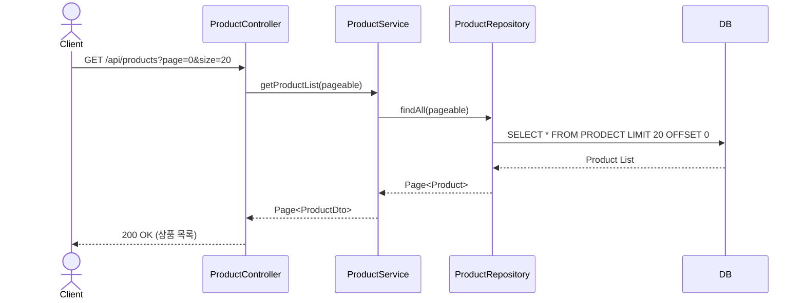
```mermaid
sequenceDiagram
    actor Client
    participant ProductController
    participant ProductService
    participant ProductRepository
    participant DB

    Client->>ProductController: GET /api/products?page=0&size=20
    ProductController->>ProductService: getProductList(pageable)
    ProductService->>ProductRepository: findAll(pageable)
    ProductRepository->>DB: SELECT * FROM PRODECT LIMIT 20 OFFSET 0
    DB-->>ProductRepository: Product List
    ProductRepository-->>ProductService: Page<Product>
    ProductService-->>ProductController: Page<ProductDto>
    ProductController-->>Client: 200 OK (상품 목록)
```

---

### 1-2. 상품 상세 조회
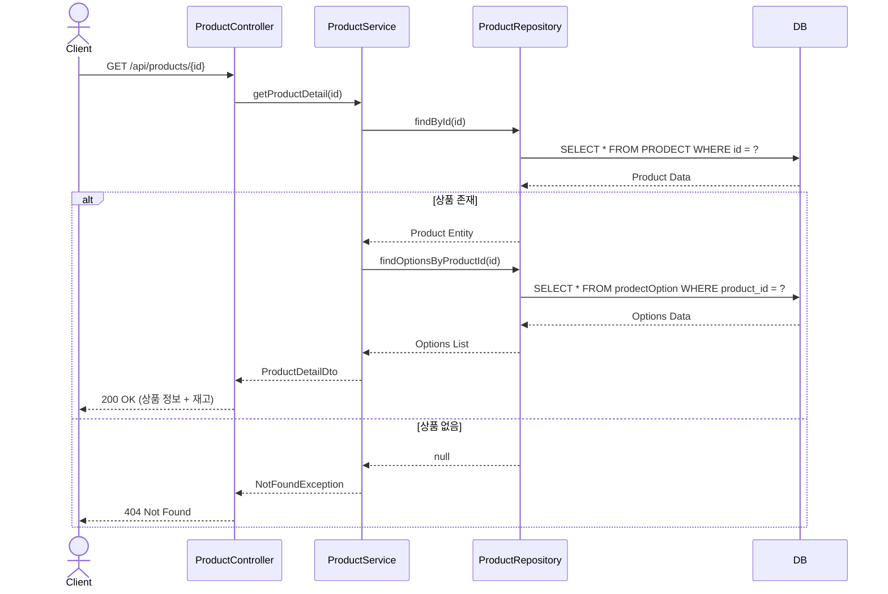
```mermaid
sequenceDiagram
    actor Client
    participant ProductController
    participant ProductService
    participant ProductRepository
    participant DB

    Client->>ProductController: GET /api/products/{id}
    ProductController->>ProductService: getProductDetail(id)
    ProductService->>ProductRepository: findById(id)
    ProductRepository->>DB: SELECT * FROM PRODECT WHERE id = ?
    DB-->>ProductRepository: Product Data

    alt 상품 존재
        ProductRepository-->>ProductService: Product Entity
        ProductService->>ProductRepository: findOptionsByProductId(id)
        ProductRepository->>DB: SELECT * FROM prodectOption WHERE product_id = ?
        DB-->>ProductRepository: Options Data
        ProductRepository-->>ProductService: Options List
        ProductService-->>ProductController: ProductDetailDto
        ProductController-->>Client: 200 OK (상품 정보 + 재고)
    else 상품 없음
        ProductRepository-->>ProductService: null
        ProductService-->>ProductController: NotFoundException
        ProductController-->>Client: 404 Not Found
    end
```

---

### 1-3. 인기 상품 조회 (최근 3일, Top 5)
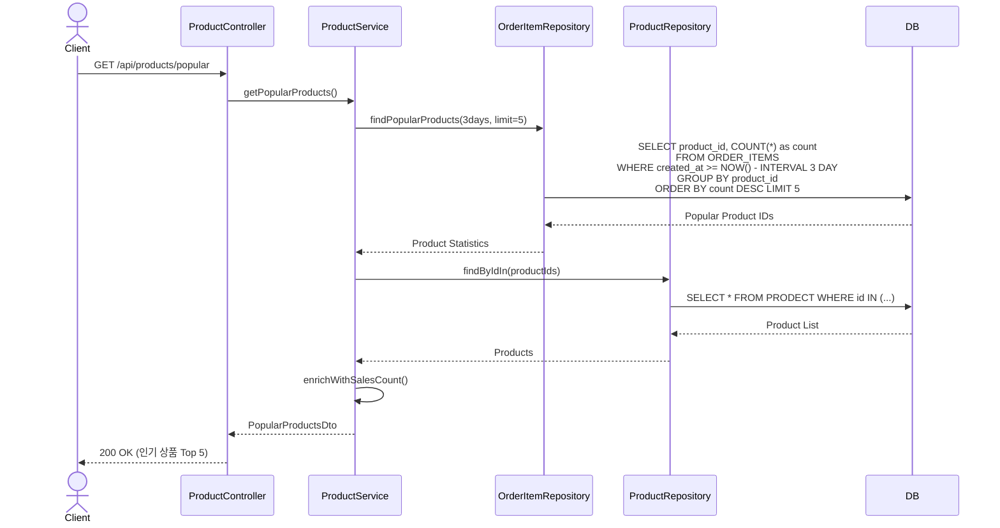
```mermaid
sequenceDiagram
    actor Client
    participant ProductController
    participant ProductService
    participant OrderItemRepository
    participant ProductRepository
    participant DB

    Client->>ProductController: GET /api/products/popular
    ProductController->>ProductService: getPopularProducts()
    ProductService->>OrderItemRepository: findPopularProducts(3days, limit=5)
    OrderItemRepository->>DB: SELECT product_id, COUNT(*) as count<br/>FROM ORDER_ITEMS<br/>WHERE created_at >= NOW() - INTERVAL 3 DAY<br/>GROUP BY product_id<br/>ORDER BY count DESC LIMIT 5
    DB-->>OrderItemRepository: Popular Product IDs
    OrderItemRepository-->>ProductService: Product Statistics

    ProductService->>ProductRepository: findByIdIn(productIds)
    ProductRepository->>DB: SELECT * FROM PRODECT WHERE id IN (...)
    DB-->>ProductRepository: Product List
    ProductRepository-->>ProductService: Products

    ProductService->>ProductService: enrichWithSalesCount()
    ProductService-->>ProductController: PopularProductsDto
    ProductController-->>Client: 200 OK (인기 상품 Top 5)
```

---

## 2. 장바구니

### 2-1. 장바구니 조회
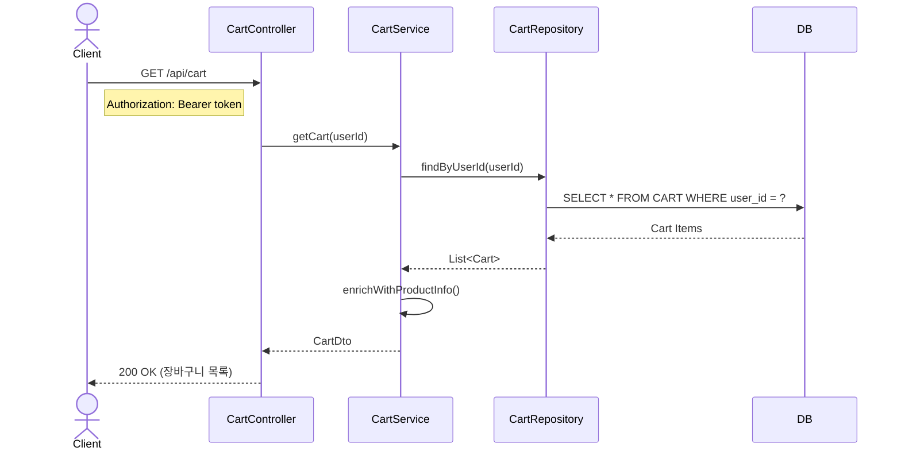
```mermaid
sequenceDiagram
    actor Client
    participant CartController
    participant CartService
    participant CartRepository
    participant DB

    Client->>CartController: GET /api/cart
    Note right of Client: Authorization: Bearer token
    CartController->>CartService: getCart(userId)
    CartService->>CartRepository: findByUserId(userId)
    CartRepository->>DB: SELECT * FROM CART WHERE user_id = ?
    DB-->>CartRepository: Cart Items
    CartRepository-->>CartService: List<Cart>
    CartService->>CartService: enrichWithProductInfo()
    CartService-->>CartController: CartDto
    CartController-->>Client: 200 OK (장바구니 목록)
```

---

### 2-2. 장바구니 추가
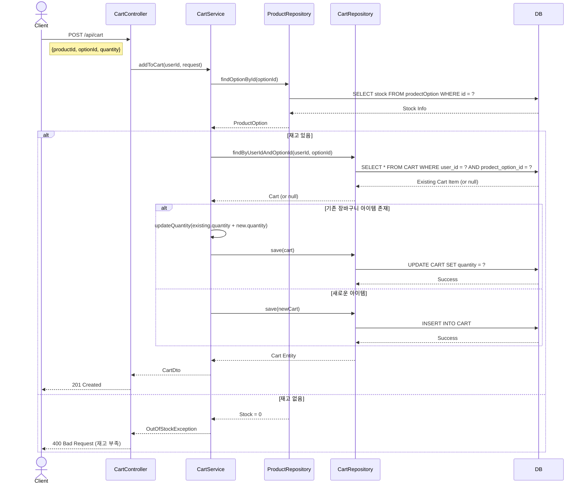
```mermaid
sequenceDiagram
    actor Client
    participant CartController
    participant CartService
    participant ProductRepository
    participant CartRepository
    participant DB

    Client->>CartController: POST /api/cart
    Note right of Client: {productId, optionId, quantity}
    CartController->>CartService: addToCart(userId, request)

    CartService->>ProductRepository: findOptionById(optionId)
    ProductRepository->>DB: SELECT stock FROM prodectOption WHERE id = ?
    DB-->>ProductRepository: Stock Info
    ProductRepository-->>CartService: ProductOption

    alt 재고 있음
        CartService->>CartRepository: findByUserIdAndOptionId(userId, optionId)
        CartRepository->>DB: SELECT * FROM CART WHERE user_id = ? AND prodect_option_id = ?
        DB-->>CartRepository: Existing Cart Item (or null)
        CartRepository-->>CartService: Cart (or null)

        alt 기존 장바구니 아이템 존재
            CartService->>CartService: updateQuantity(existing.quantity + new.quantity)
            CartService->>CartRepository: save(cart)
            CartRepository->>DB: UPDATE CART SET quantity = ?
            DB-->>CartRepository: Success
        else 새로운 아이템
            CartService->>CartRepository: save(newCart)
            CartRepository->>DB: INSERT INTO CART
            DB-->>CartRepository: Success
        end

        CartRepository-->>CartService: Cart Entity
        CartService-->>CartController: CartDto
        CartController-->>Client: 201 Created
    else 재고 없음
        ProductRepository-->>CartService: Stock = 0
        CartService-->>CartController: OutOfStockException
        CartController-->>Client: 400 Bad Request (재고 부족)
    end
```

---

### 2-3. 장바구니 수량 변경
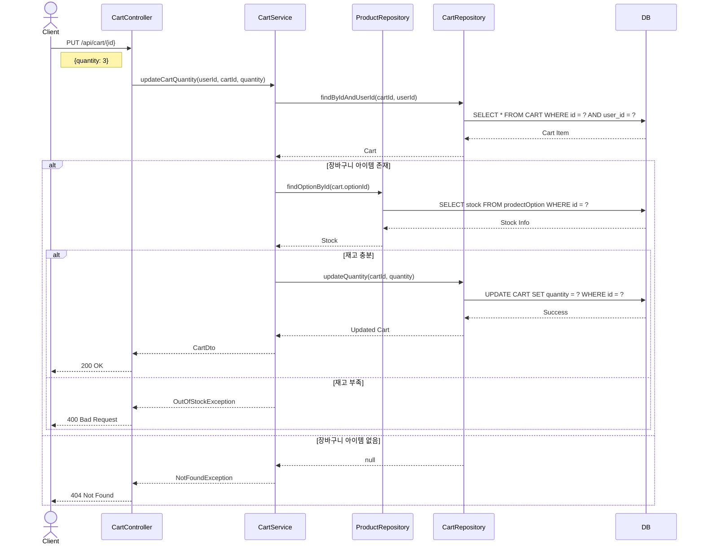
```mermaid
sequenceDiagram
    actor Client
    participant CartController
    participant CartService
    participant ProductRepository
    participant CartRepository
    participant DB

    Client->>CartController: PUT /api/cart/{id}
    Note right of Client: {quantity: 3}
    CartController->>CartService: updateCartQuantity(userId, cartId, quantity)

    CartService->>CartRepository: findByIdAndUserId(cartId, userId)
    CartRepository->>DB: SELECT * FROM CART WHERE id = ? AND user_id = ?
    DB-->>CartRepository: Cart Item
    CartRepository-->>CartService: Cart

    alt 장바구니 아이템 존재
        CartService->>ProductRepository: findOptionById(cart.optionId)
        ProductRepository->>DB: SELECT stock FROM prodectOption WHERE id = ?
        DB-->>ProductRepository: Stock Info
        ProductRepository-->>CartService: Stock

        alt 재고 충분
            CartService->>CartRepository: updateQuantity(cartId, quantity)
            CartRepository->>DB: UPDATE CART SET quantity = ? WHERE id = ?
            DB-->>CartRepository: Success
            CartRepository-->>CartService: Updated Cart
            CartService-->>CartController: CartDto
            CartController-->>Client: 200 OK
        else 재고 부족
            CartService-->>CartController: OutOfStockException
            CartController-->>Client: 400 Bad Request
        end
    else 장바구니 아이템 없음
        CartRepository-->>CartService: null
        CartService-->>CartController: NotFoundException
        CartController-->>Client: 404 Not Found
    end
```

---

### 2-4. 장바구니 삭제
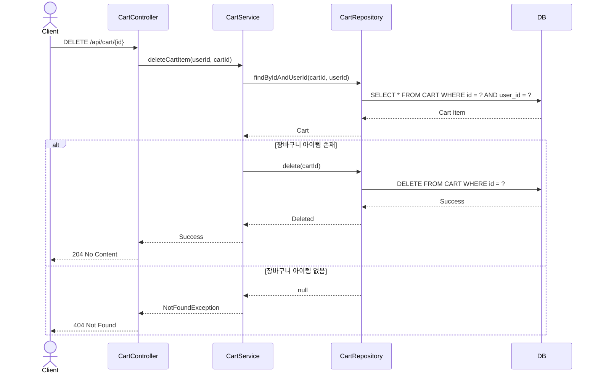
```mermaid
sequenceDiagram
    actor Client
    participant CartController
    participant CartService
    participant CartRepository
    participant DB

    Client->>CartController: DELETE /api/cart/{id}
    CartController->>CartService: deleteCartItem(userId, cartId)

    CartService->>CartRepository: findByIdAndUserId(cartId, userId)
    CartRepository->>DB: SELECT * FROM CART WHERE id = ? AND user_id = ?
    DB-->>CartRepository: Cart Item
    CartRepository-->>CartService: Cart

    alt 장바구니 아이템 존재
        CartService->>CartRepository: delete(cartId)
        CartRepository->>DB: DELETE FROM CART WHERE id = ?
        DB-->>CartRepository: Success
        CartRepository-->>CartService: Deleted
        CartService-->>CartController: Success
        CartController-->>Client: 204 No Content
    else 장바구니 아이템 없음
        CartRepository-->>CartService: null
        CartService-->>CartController: NotFoundException
        CartController-->>Client: 404 Not Found
    end
```

---

## 3. 포인트

### 3-1. 포인트 조회
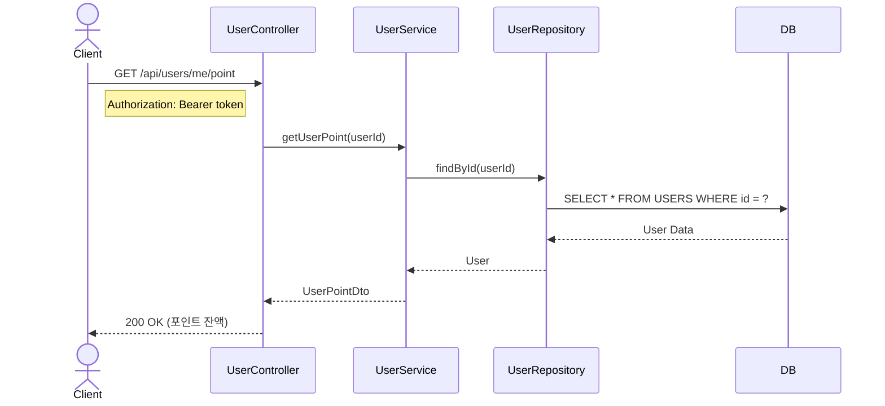
```mermaid
sequenceDiagram
    actor Client
    participant UserController
    participant UserService
    participant UserRepository
    participant DB

    Client->>UserController: GET /api/users/me/point
    Note right of Client: Authorization: Bearer token
    UserController->>UserService: getUserPoint(userId)
    UserService->>UserRepository: findById(userId)
    UserRepository->>DB: SELECT * FROM USERS WHERE id = ?
    DB-->>UserRepository: User Data
    UserRepository-->>UserService: User
    UserService-->>UserController: UserPointDto
    UserController-->>Client: 200 OK (포인트 잔액)
```

---

### 3-2. 포인트 충전
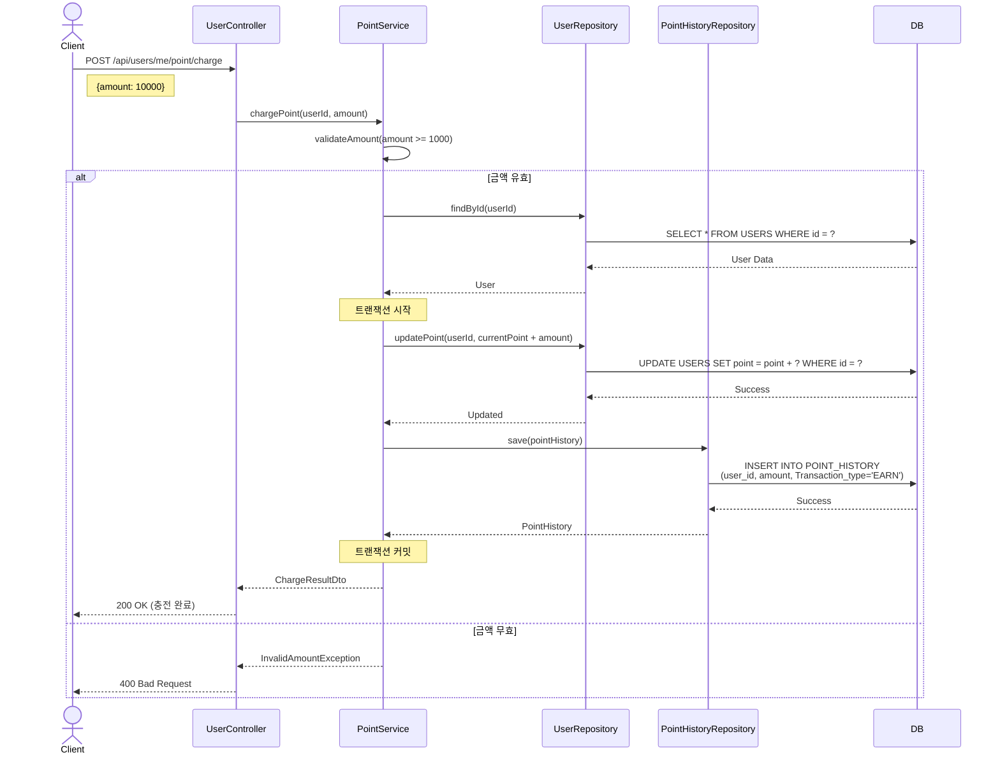
```mermaid
sequenceDiagram
    actor Client
    participant UserController
    participant PointService
    participant UserRepository
    participant PointHistoryRepository
    participant DB

    Client->>UserController: POST /api/users/me/point/charge
    Note right of Client: {amount: 10000}
    UserController->>PointService: chargePoint(userId, amount)

    PointService->>PointService: validateAmount(amount >= 1000)

    alt 금액 유효
        PointService->>UserRepository: findById(userId)
        UserRepository->>DB: SELECT * FROM USERS WHERE id = ?
        DB-->>UserRepository: User Data
        UserRepository-->>PointService: User

        Note over PointService: 트랜잭션 시작

        PointService->>UserRepository: updatePoint(userId, currentPoint + amount)
        UserRepository->>DB: UPDATE USERS SET point = point + ? WHERE id = ?
        DB-->>UserRepository: Success
        UserRepository-->>PointService: Updated

        PointService->>PointHistoryRepository: save(pointHistory)
        PointHistoryRepository->>DB: INSERT INTO POINT_HISTORY<br/>(user_id, amount, Transaction_type='EARN')
        DB-->>PointHistoryRepository: Success
        PointHistoryRepository-->>PointService: PointHistory

        Note over PointService: 트랜잭션 커밋

        PointService-->>UserController: ChargeResultDto
        UserController-->>Client: 200 OK (충전 완료)
    else 금액 무효
        PointService-->>UserController: InvalidAmountException
        UserController-->>Client: 400 Bad Request
    end
```

---

### 3-3. 포인트 사용 이력 조회
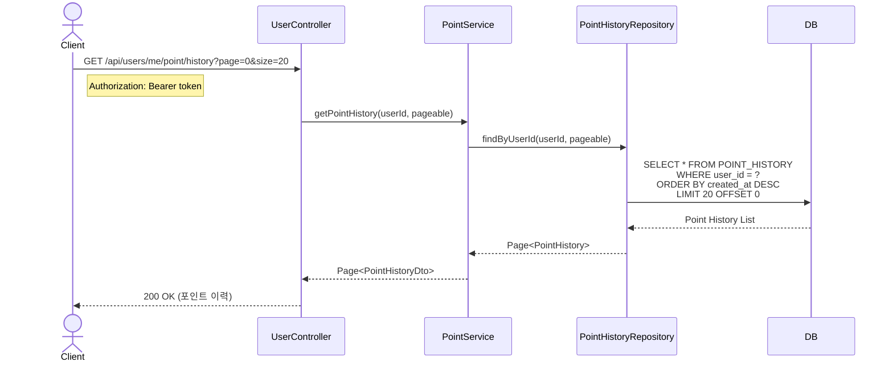
```mermaid
sequenceDiagram
    actor Client
    participant UserController
    participant PointService
    participant PointHistoryRepository
    participant DB

    Client->>UserController: GET /api/users/me/point/history?page=0&size=20
    Note right of Client: Authorization: Bearer token
    UserController->>PointService: getPointHistory(userId, pageable)
    PointService->>PointHistoryRepository: findByUserId(userId, pageable)
    PointHistoryRepository->>DB: SELECT * FROM POINT_HISTORY<br/>WHERE user_id = ?<br/>ORDER BY created_at DESC<br/>LIMIT 20 OFFSET 0
    DB-->>PointHistoryRepository: Point History List
    PointHistoryRepository-->>PointService: Page<PointHistory>
    PointService-->>UserController: Page<PointHistoryDto>
    UserController-->>Client: 200 OK (포인트 이력)
```

---

## 4. 쿠폰 시스템

### 4-1. 선착순 쿠폰 발급
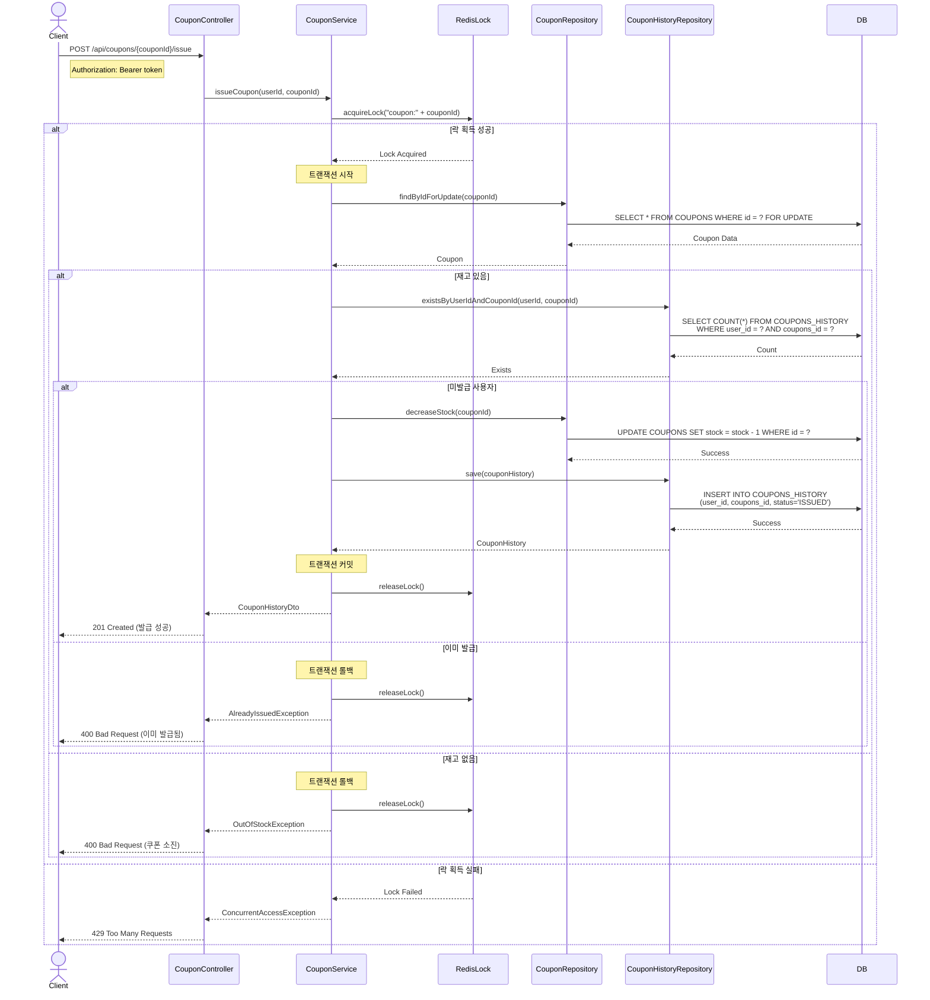
```mermaid
sequenceDiagram
    actor Client
    participant CouponController
    participant CouponService
    participant RedisLock
    participant CouponRepository
    participant CouponHistoryRepository
    participant DB

    Client->>CouponController: POST /api/coupons/{couponId}/issue
    Note right of Client: Authorization: Bearer token
    CouponController->>CouponService: issueCoupon(userId, couponId)

    CouponService->>RedisLock: acquireLock("coupon:" + couponId)

    alt 락 획득 성공
        RedisLock-->>CouponService: Lock Acquired

        Note over CouponService: 트랜잭션 시작

        CouponService->>CouponRepository: findByIdForUpdate(couponId)
        CouponRepository->>DB: SELECT * FROM COUPONS WHERE id = ? FOR UPDATE
        DB-->>CouponRepository: Coupon Data
        CouponRepository-->>CouponService: Coupon

        alt 재고 있음
            CouponService->>CouponHistoryRepository: existsByUserIdAndCouponId(userId, couponId)
            CouponHistoryRepository->>DB: SELECT COUNT(*) FROM COUPONS_HISTORY<br/>WHERE user_id = ? AND coupons_id = ?
            DB-->>CouponHistoryRepository: Count
            CouponHistoryRepository-->>CouponService: Exists

            alt 미발급 사용자
                CouponService->>CouponRepository: decreaseStock(couponId)
                CouponRepository->>DB: UPDATE COUPONS SET stock = stock - 1 WHERE id = ?
                DB-->>CouponRepository: Success

                CouponService->>CouponHistoryRepository: save(couponHistory)
                CouponHistoryRepository->>DB: INSERT INTO COUPONS_HISTORY<br/>(user_id, coupons_id, status='ISSUED')
                DB-->>CouponHistoryRepository: Success
                CouponHistoryRepository-->>CouponService: CouponHistory

                Note over CouponService: 트랜잭션 커밋

                CouponService->>RedisLock: releaseLock()
                CouponService-->>CouponController: CouponHistoryDto
                CouponController-->>Client: 201 Created (발급 성공)
            else 이미 발급
                Note over CouponService: 트랜잭션 롤백
                CouponService->>RedisLock: releaseLock()
                CouponService-->>CouponController: AlreadyIssuedException
                CouponController-->>Client: 400 Bad Request (이미 발급됨)
            end
        else 재고 없음
            Note over CouponService: 트랜잭션 롤백
            CouponService->>RedisLock: releaseLock()
            CouponService-->>CouponController: OutOfStockException
            CouponController-->>Client: 400 Bad Request (쿠폰 소진)
        end
    else 락 획득 실패
        RedisLock-->>CouponService: Lock Failed
        CouponService-->>CouponController: ConcurrentAccessException
        CouponController-->>Client: 429 Too Many Requests
    end
```

---

### 4-2. 내 쿠폰 조회
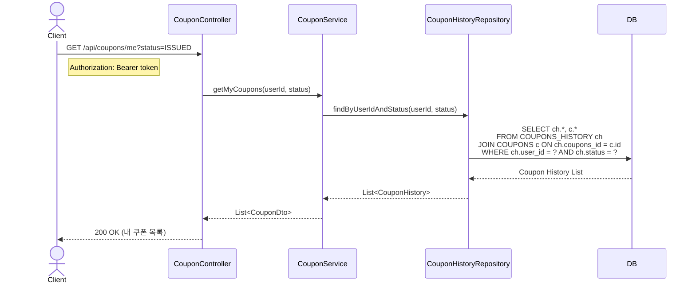
```mermaid
sequenceDiagram
    actor Client
    participant CouponController
    participant CouponService
    participant CouponHistoryRepository
    participant DB

    Client->>CouponController: GET /api/coupons/me?status=ISSUED
    Note right of Client: Authorization: Bearer token
    CouponController->>CouponService: getMyCoupons(userId, status)
    CouponService->>CouponHistoryRepository: findByUserIdAndStatus(userId, status)
    CouponHistoryRepository->>DB: SELECT ch.*, c.*<br/>FROM COUPONS_HISTORY ch<br/>JOIN COUPONS c ON ch.coupons_id = c.id<br/>WHERE ch.user_id = ? AND ch.status = ?
    DB-->>CouponHistoryRepository: Coupon History List
    CouponHistoryRepository-->>CouponService: List<CouponHistory>
    CouponService-->>CouponController: List<CouponDto>
    CouponController-->>Client: 200 OK (내 쿠폰 목록)
```

---

### 4-3. 쿠폰 유효성 검증
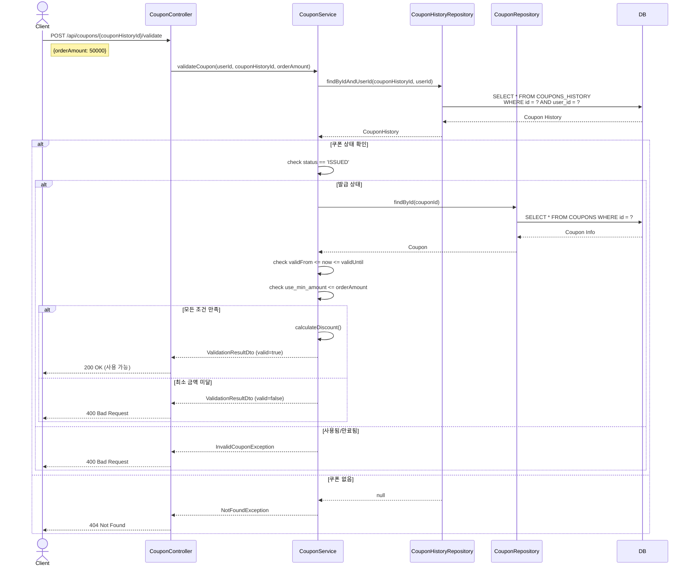
```mermaid
sequenceDiagram
    actor Client
    participant CouponController
    participant CouponService
    participant CouponHistoryRepository
    participant CouponRepository
    participant DB

    Client->>CouponController: POST /api/coupons/{couponHistoryId}/validate
    Note right of Client: {orderAmount: 50000}
    CouponController->>CouponService: validateCoupon(userId, couponHistoryId, orderAmount)

    CouponService->>CouponHistoryRepository: findByIdAndUserId(couponHistoryId, userId)
    CouponHistoryRepository->>DB: SELECT * FROM COUPONS_HISTORY<br/>WHERE id = ? AND user_id = ?
    DB-->>CouponHistoryRepository: Coupon History
    CouponHistoryRepository-->>CouponService: CouponHistory

    alt 쿠폰 상태 확인
        CouponService->>CouponService: check status == 'ISSUED'

        alt 발급 상태
            CouponService->>CouponRepository: findById(couponId)
            CouponRepository->>DB: SELECT * FROM COUPONS WHERE id = ?
            DB-->>CouponRepository: Coupon Info
            CouponRepository-->>CouponService: Coupon

            CouponService->>CouponService: check validFrom <= now <= validUntil
            CouponService->>CouponService: check use_min_amount <= orderAmount

            alt 모든 조건 만족
                CouponService->>CouponService: calculateDiscount()
                CouponService-->>CouponController: ValidationResultDto (valid=true)
                CouponController-->>Client: 200 OK (사용 가능)
            else 최소 금액 미달
                CouponService-->>CouponController: ValidationResultDto (valid=false)
                CouponController-->>Client: 400 Bad Request
            end
        else 사용됨/만료됨
            CouponService-->>CouponController: InvalidCouponException
            CouponController-->>Client: 400 Bad Request
        end
    else 쿠폰 없음
        CouponHistoryRepository-->>CouponService: null
        CouponService-->>CouponController: NotFoundException
        CouponController-->>Client: 404 Not Found
    end
```

---

## 5. 주문

### 5-1. 주문 생성
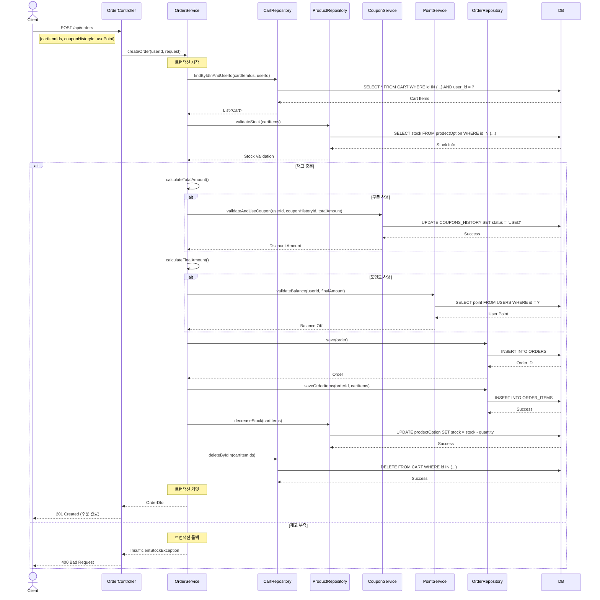
```mermaid
sequenceDiagram
    actor Client
    participant OrderController
    participant OrderService
    participant CartRepository
    participant ProductRepository
    participant CouponService
    participant PointService
    participant OrderRepository
    participant DB

    Client->>OrderController: POST /api/orders
    Note right of Client: {cartItemIds, couponHistoryId, usePoint}
    OrderController->>OrderService: createOrder(userId, request)

    Note over OrderService: 트랜잭션 시작

    OrderService->>CartRepository: findByIdInAndUserId(cartItemIds, userId)
    CartRepository->>DB: SELECT * FROM CART WHERE id IN (...) AND user_id = ?
    DB-->>CartRepository: Cart Items
    CartRepository-->>OrderService: List<Cart>

    OrderService->>ProductRepository: validateStock(cartItems)
    ProductRepository->>DB: SELECT stock FROM prodectOption WHERE id IN (...)
    DB-->>ProductRepository: Stock Info
    ProductRepository-->>OrderService: Stock Validation

    alt 재고 충분
        OrderService->>OrderService: calculateTotalAmount()

        alt 쿠폰 사용
            OrderService->>CouponService: validateAndUseCoupon(userId, couponHistoryId, totalAmount)
            CouponService->>DB: UPDATE COUPONS_HISTORY SET status = 'USED'
            DB-->>CouponService: Success
            CouponService-->>OrderService: Discount Amount
        end

        OrderService->>OrderService: calculateFinalAmount()

        alt 포인트 사용
            OrderService->>PointService: validateBalance(userId, finalAmount)
            PointService->>DB: SELECT point FROM USERS WHERE id = ?
            DB-->>PointService: User Point
            PointService-->>OrderService: Balance OK
        end

        OrderService->>OrderRepository: save(order)
        OrderRepository->>DB: INSERT INTO ORDERS
        DB-->>OrderRepository: Order ID
        OrderRepository-->>OrderService: Order

        OrderService->>OrderRepository: saveOrderItems(orderId, cartItems)
        OrderRepository->>DB: INSERT INTO ORDER_ITEMS
        DB-->>OrderRepository: Success

        OrderService->>ProductRepository: decreaseStock(cartItems)
        ProductRepository->>DB: UPDATE prodectOption SET stock = stock - quantity
        DB-->>ProductRepository: Success

        OrderService->>CartRepository: deleteByIdIn(cartItemIds)
        CartRepository->>DB: DELETE FROM CART WHERE id IN (...)
        DB-->>CartRepository: Success

        Note over OrderService: 트랜잭션 커밋

        OrderService-->>OrderController: OrderDto
        OrderController-->>Client: 201 Created (주문 완료)
    else 재고 부족
        Note over OrderService: 트랜잭션 롤백
        OrderService-->>OrderController: InsufficientStockException
        OrderController-->>Client: 400 Bad Request
    end
```

---

### 5-2. 주문 목록 조회
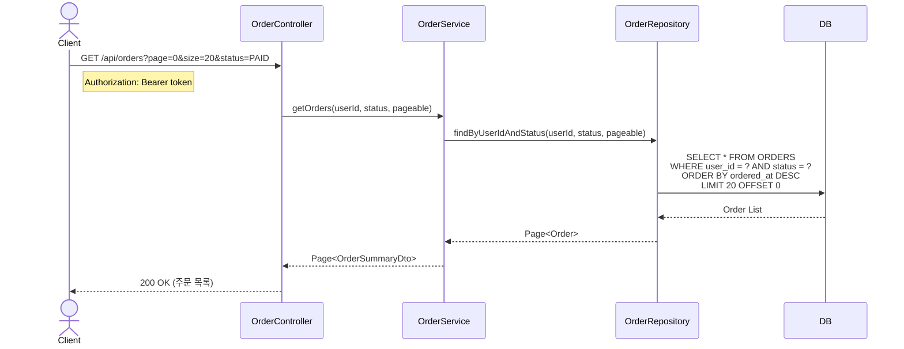
```mermaid
sequenceDiagram
    actor Client
    participant OrderController
    participant OrderService
    participant OrderRepository
    participant DB

    Client->>OrderController: GET /api/orders?page=0&size=20&status=PAID
    Note right of Client: Authorization: Bearer token
    OrderController->>OrderService: getOrders(userId, status, pageable)
    OrderService->>OrderRepository: findByUserIdAndStatus(userId, status, pageable)
    OrderRepository->>DB: SELECT * FROM ORDERS<br/>WHERE user_id = ? AND status = ?<br/>ORDER BY ordered_at DESC<br/>LIMIT 20 OFFSET 0
    DB-->>OrderRepository: Order List
    OrderRepository-->>OrderService: Page<Order>
    OrderService-->>OrderController: Page<OrderSummaryDto>
    OrderController-->>Client: 200 OK (주문 목록)
```

---

### 5-3. 주문 상세 조회
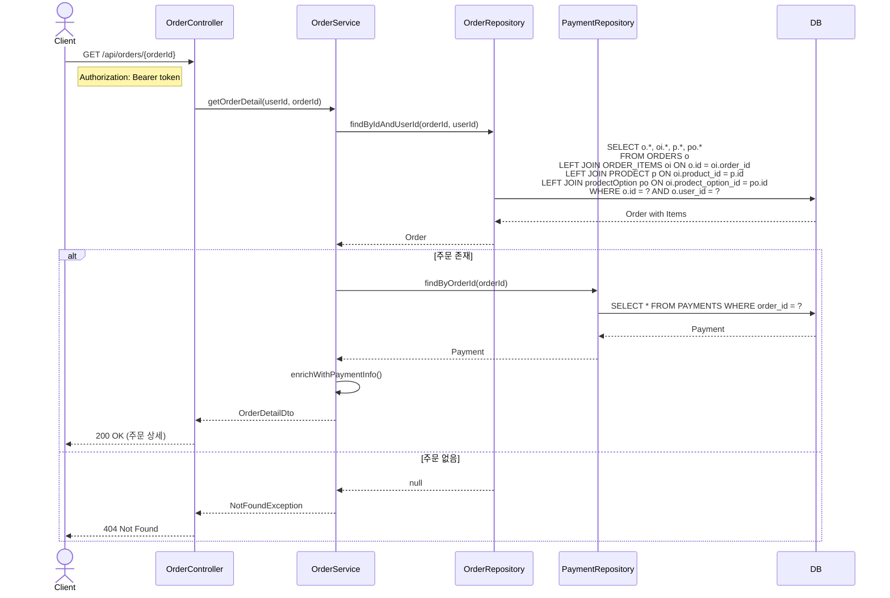
```mermaid
sequenceDiagram
    actor Client
    participant OrderController
    participant OrderService
    participant OrderRepository
    participant PaymentRepository
    participant DB

    Client->>OrderController: GET /api/orders/{orderId}
    Note right of Client: Authorization: Bearer token
    OrderController->>OrderService: getOrderDetail(userId, orderId)

    OrderService->>OrderRepository: findByIdAndUserId(orderId, userId)
    OrderRepository->>DB: SELECT o.*, oi.*, p.*, po.*<br/>FROM ORDERS o<br/>LEFT JOIN ORDER_ITEMS oi ON o.id = oi.order_id<br/>LEFT JOIN PRODECT p ON oi.product_id = p.id<br/>LEFT JOIN prodectOption po ON oi.prodect_option_id = po.id<br/>WHERE o.id = ? AND o.user_id = ?
    DB-->>OrderRepository: Order with Items
    OrderRepository-->>OrderService: Order

    alt 주문 존재
        OrderService->>PaymentRepository: findByOrderId(orderId)
        PaymentRepository->>DB: SELECT * FROM PAYMENTS WHERE order_id = ?
        DB-->>PaymentRepository: Payment
        PaymentRepository-->>OrderService: Payment

        OrderService->>OrderService: enrichWithPaymentInfo()
        OrderService-->>OrderController: OrderDetailDto
        OrderController-->>Client: 200 OK (주문 상세)
    else 주문 없음
        OrderRepository-->>OrderService: null
        OrderService-->>OrderController: NotFoundException
        OrderController-->>Client: 404 Not Found
    end
```

---

### 5-4. 주문 취소
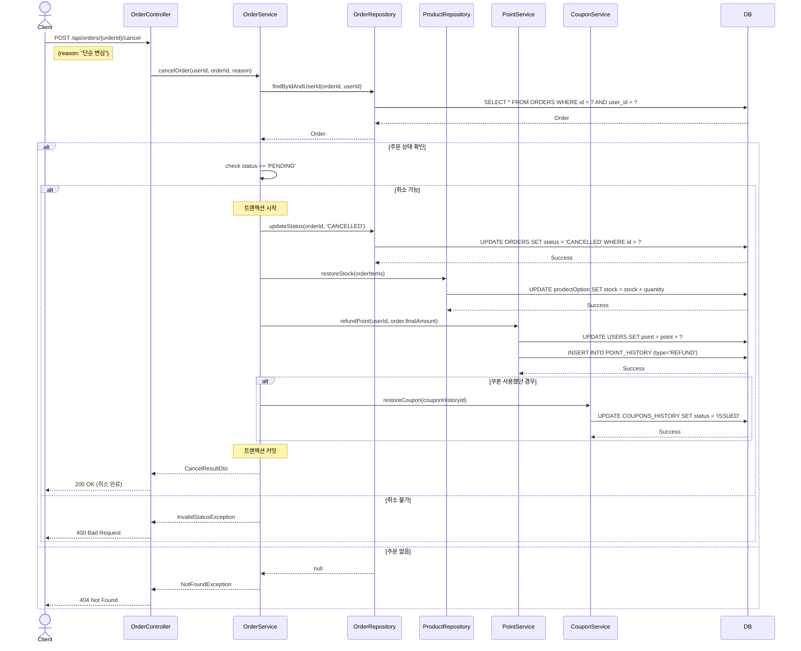
```mermaid
sequenceDiagram
    actor Client
    participant OrderController
    participant OrderService
    participant OrderRepository
    participant ProductRepository
    participant PointService
    participant CouponService
    participant DB

    Client->>OrderController: POST /api/orders/{orderId}/cancel
    Note right of Client: {reason: "단순 변심"}
    OrderController->>OrderService: cancelOrder(userId, orderId, reason)

    OrderService->>OrderRepository: findByIdAndUserId(orderId, userId)
    OrderRepository->>DB: SELECT * FROM ORDERS WHERE id = ? AND user_id = ?
    DB-->>OrderRepository: Order
    OrderRepository-->>OrderService: Order

    alt 주문 상태 확인
        OrderService->>OrderService: check status == 'PENDING'

        alt 취소 가능
            Note over OrderService: 트랜잭션 시작

            OrderService->>OrderRepository: updateStatus(orderId, 'CANCELLED')
            OrderRepository->>DB: UPDATE ORDERS SET status = 'CANCELLED' WHERE id = ?
            DB-->>OrderRepository: Success

            OrderService->>ProductRepository: restoreStock(orderItems)
            ProductRepository->>DB: UPDATE prodectOption SET stock = stock + quantity
            DB-->>ProductRepository: Success

            OrderService->>PointService: refundPoint(userId, order.finalAmount)
            PointService->>DB: UPDATE USERS SET point = point + ?
            PointService->>DB: INSERT INTO POINT_HISTORY (type='REFUND')
            DB-->>PointService: Success

            alt 쿠폰 사용했던 경우
                OrderService->>CouponService: restoreCoupon(couponHistoryId)
                CouponService->>DB: UPDATE COUPONS_HISTORY SET status = 'ISSUED'
                DB-->>CouponService: Success
            end

            Note over OrderService: 트랜잭션 커밋

            OrderService-->>OrderController: CancelResultDto
            OrderController-->>Client: 200 OK (취소 완료)
        else 취소 불가
            OrderService-->>OrderController: InvalidStatusException
            OrderController-->>Client: 400 Bad Request
        end
    else 주문 없음
        OrderRepository-->>OrderService: null
        OrderService-->>OrderController: NotFoundException
        OrderController-->>Client: 404 Not Found
    end
```

---

## 6. 결제

### 6-1. 결제 처리
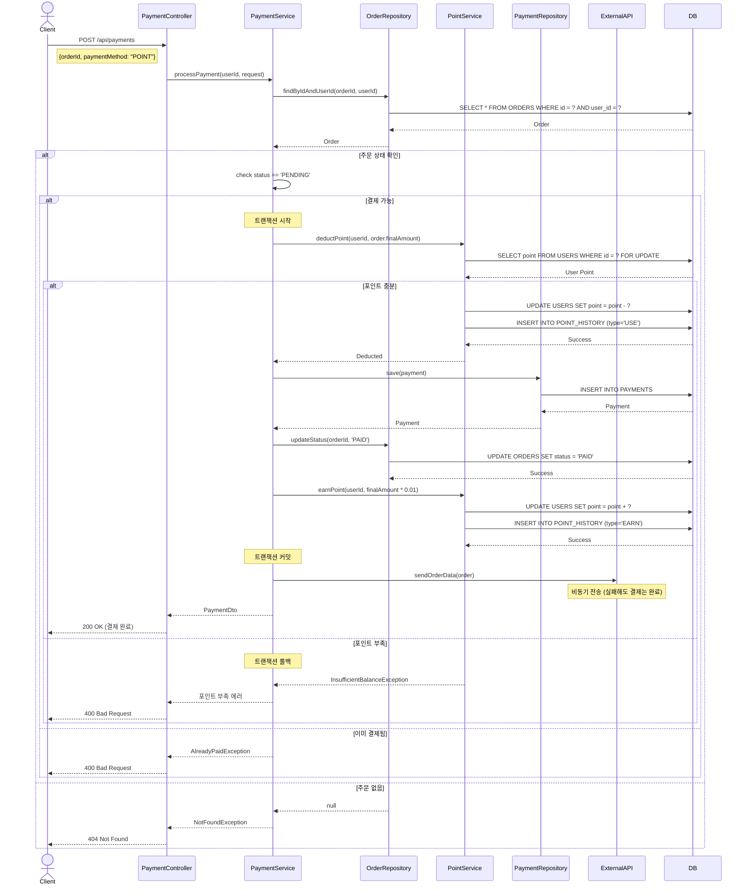
```mermaid
sequenceDiagram
    actor Client
    participant PaymentController
    participant PaymentService
    participant OrderRepository
    participant PointService
    participant PaymentRepository
    participant ExternalAPI
    participant DB

    Client->>PaymentController: POST /api/payments
    Note right of Client: {orderId, paymentMethod: "POINT"}
    PaymentController->>PaymentService: processPayment(userId, request)

    PaymentService->>OrderRepository: findByIdAndUserId(orderId, userId)
    OrderRepository->>DB: SELECT * FROM ORDERS WHERE id = ? AND user_id = ?
    DB-->>OrderRepository: Order
    OrderRepository-->>PaymentService: Order

    alt 주문 상태 확인
        PaymentService->>PaymentService: check status == 'PENDING'

        alt 결제 가능
            Note over PaymentService: 트랜잭션 시작

            PaymentService->>PointService: deductPoint(userId, order.finalAmount)
            PointService->>DB: SELECT point FROM USERS WHERE id = ? FOR UPDATE
            DB-->>PointService: User Point

            alt 포인트 충분
                PointService->>DB: UPDATE USERS SET point = point - ?
                PointService->>DB: INSERT INTO POINT_HISTORY (type='USE')
                DB-->>PointService: Success
                PointService-->>PaymentService: Deducted

                PaymentService->>PaymentRepository: save(payment)
                PaymentRepository->>DB: INSERT INTO PAYMENTS
                DB-->>PaymentRepository: Payment
                PaymentRepository-->>PaymentService: Payment

                PaymentService->>OrderRepository: updateStatus(orderId, 'PAID')
                OrderRepository->>DB: UPDATE ORDERS SET status = 'PAID'
                DB-->>OrderRepository: Success

                PaymentService->>PointService: earnPoint(userId, finalAmount * 0.01)
                PointService->>DB: UPDATE USERS SET point = point + ?
                PointService->>DB: INSERT INTO POINT_HISTORY (type='EARN')
                DB-->>PointService: Success

                Note over PaymentService: 트랜잭션 커밋

                PaymentService->>ExternalAPI: sendOrderData(order)
                Note over ExternalAPI: 비동기 전송 (실패해도 결제는 완료)

                PaymentService-->>PaymentController: PaymentDto
                PaymentController-->>Client: 200 OK (결제 완료)
            else 포인트 부족
                Note over PaymentService: 트랜잭션 롤백
                PointService-->>PaymentService: InsufficientBalanceException
                PaymentService-->>PaymentController: 포인트 부족 에러
                PaymentController-->>Client: 400 Bad Request
            end
        else 이미 결제됨
            PaymentService-->>PaymentController: AlreadyPaidException
            PaymentController-->>Client: 400 Bad Request
        end
    else 주문 없음
        OrderRepository-->>PaymentService: null
        PaymentService-->>PaymentController: NotFoundException
        PaymentController-->>Client: 404 Not Found
    end
```

---

### 6-2. 결제 조회
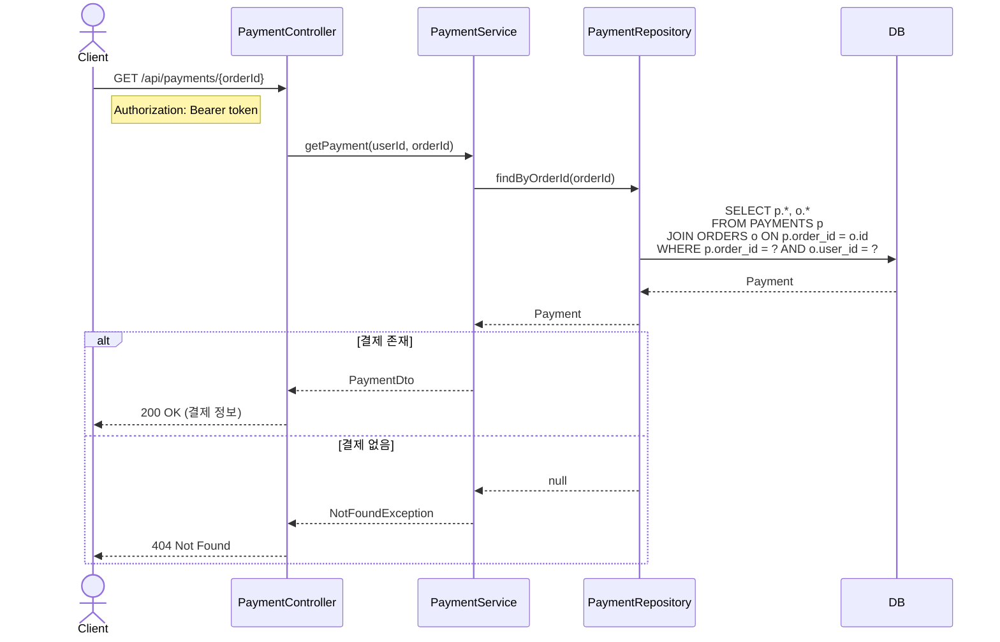
```mermaid
sequenceDiagram
    actor Client
    participant PaymentController
    participant PaymentService
    participant PaymentRepository
    participant DB

    Client->>PaymentController: GET /api/payments/{orderId}
    Note right of Client: Authorization: Bearer token
    PaymentController->>PaymentService: getPayment(userId, orderId)

    PaymentService->>PaymentRepository: findByOrderId(orderId)
    PaymentRepository->>DB: SELECT p.*, o.*<br/>FROM PAYMENTS p<br/>JOIN ORDERS o ON p.order_id = o.id<br/>WHERE p.order_id = ? AND o.user_id = ?
    DB-->>PaymentRepository: Payment
    PaymentRepository-->>PaymentService: Payment

    alt 결제 존재
        PaymentService-->>PaymentController: PaymentDto
        PaymentController-->>Client: 200 OK (결제 정보)
    else 결제 없음
        PaymentRepository-->>PaymentService: null
        PaymentService-->>PaymentController: NotFoundException
        PaymentController-->>Client: 404 Not Found
    end
```

---

## 7. 외부 데이터 전송

### 7-1. 주문 데이터 전송 (비동기)
```mermaid
sequenceDiagram
    participant PaymentService
    participant MessageQueue
    participant ExternalSyncService
    participant ExternalAPI
    participant SyncLogRepository
    participant DB

    PaymentService->>MessageQueue: publish(OrderCompletedEvent)
    Note right of PaymentService: orderId, userId, amount 등
    MessageQueue-->>PaymentService: ACK

    Note over MessageQueue,ExternalSyncService: 비동기 처리

    MessageQueue->>ExternalSyncService: consume(OrderCompletedEvent)

    ExternalSyncService->>ExternalAPI: POST /external/orders
    Note right of ExternalSyncService: 주문 데이터 전송

    alt 전송 성공
        ExternalAPI-->>ExternalSyncService: 200 OK
        ExternalSyncService->>SyncLogRepository: save(syncLog)
        SyncLogRepository->>DB: INSERT INTO EXTERNAL_SYNC_LOG<br/>(order_id, status='SUCCESS')
        DB-->>SyncLogRepository: Success
        SyncLogRepository-->>ExternalSyncService: Saved
        ExternalSyncService->>MessageQueue: ACK
    else 전송 실패
        ExternalAPI-->>ExternalSyncService: 500 Error
        ExternalSyncService->>SyncLogRepository: save(syncLog)
        SyncLogRepository->>DB: INSERT INTO EXTERNAL_SYNC_LOG<br/>(order_id, status='FAILED', retry_count=1)
        DB-->>SyncLogRepository: Success
        SyncLogRepository-->>ExternalSyncService: Saved

        alt 재시도 가능 (retry_count < 3)
            ExternalSyncService->>MessageQueue: NACK (requeue)
            Note over ExternalSyncService: 재시도 대기열로 이동
        else 재시도 초과
            ExternalSyncService->>SyncLogRepository: updateStatus(id, 'FAILED_PERMANENT')
            SyncLogRepository->>DB: UPDATE EXTERNAL_SYNC_LOG<br/>SET status = 'FAILED_PERMANENT'
            DB-->>SyncLogRepository: Success
            ExternalSyncService->>MessageQueue: ACK (DLQ로 이동)
            ExternalSyncService->>ExternalSyncService: sendAlert(admin)
            Note over ExternalSyncService: 관리자에게 알림 발송
        end
    end
```

---

## 범례 (Legend)

### 다이어그램 표기법
- **Actor**: 사용자 또는 외부 시스템
- **Participant**: 시스템 컴포넌트
- **Solid Arrow (→)**: 동기 호출
- **Dashed Arrow (--→)**: 응답
- **Note**: 주요 설명 또는 상태 변경
- **alt/else**: 조건부 분기
- **opt**: 선택적 실행

### 공통 HTTP 상태 코드
- **200 OK**: 성공
- **201 Created**: 리소스 생성 성공
- **204 No Content**: 성공 (응답 본문 없음)
- **400 Bad Request**: 잘못된 요청
- **401 Unauthorized**: 인증 필요
- **403 Forbidden**: 권한 없음
- **404 Not Found**: 리소스 없음
- **409 Conflict**: 리소스 충돌
- **429 Too Many Requests**: 요청 제한 초과
- **500 Internal Server Error**: 서버 오류

---

**작성일:** 2024-10-30
**버전:** 2.0
**변경 이력:**
- v2.0 (2024-10-30): API 명세서 기반 전체 시퀀스 다이어그램 재작성
- v1.0 (2024-10-30): 초기 작성
